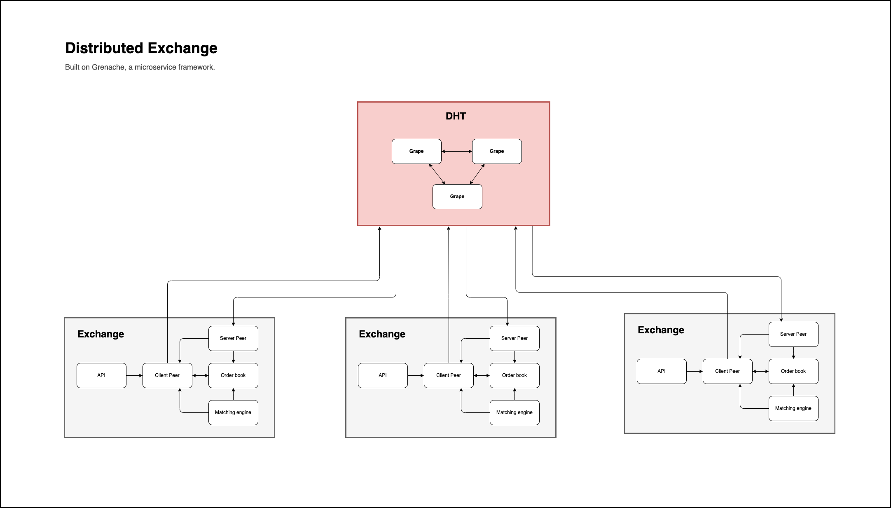

# Distributed Exchange

A distributed exchange built on the Bitfinex Grenache RCP framework.



## Installation

- Pull/download this repo, in the project directory run `yarn install`
- Then run `npm i -g grenache-grape` to install grenache globally

## Usage

- Boot up two grape servers by running `yarn start:grape-servers`
- Run `yarn start:exchange` on multiple terminals to create different instances of the exchnage.
- Each exchange instance provides an API service for interacting with the Client Peer. The API and Server Peer ports are auto generated and will be displayed on the terminal when the exchange is initiated.

## API

Here are the API endpoints for interacting with the Client Peer.

### Get Order Book

Displays all orders in the exchange's order book.

```
curl -X GET 'localhost:[port]/order-book/'
```

### Get Order

Get one order type by the order id

```
curl -X GET 'localhost:[port]/order-book/["buy" | "sell"]/[order id]'
```

### Create Order

Create new order on the exchange instance.

```
curl -X POST \
  'localhost:[port]/order-book/' \
  --header 'Content-Type: application/json' \
  --data-raw '{
  "type": ["sell" | "buy"],
  "price": [number],
  "qty": [number]
}'
```

### Cancel Order

Cancel an order and remove it from the exchange's order book.

```
curl -X POST \
  'localhost:[port]/order-book/cancel' \
  --header 'Content-Type: application/json' \
  --data-raw '{
  "id": [string],
  "type": ["sell" | "buy"]
}'
```

### Log Order Book

Tell all exchange instances to log the current state of thier order book.

```
curl -X POST 'localhost:1800/order-book/log'
```

## Features
- Create orders
- Cancel orders
- Automated order matching
- Handles race condition between distributed exchange instances
